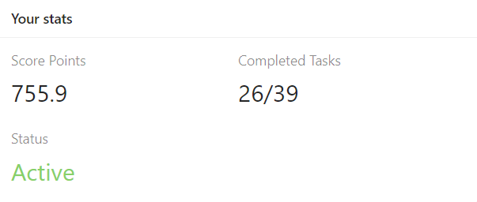

# Evgeniia Zhadan

## Contacts

**Location**: Moscow, Russia

**Phone number**: +7 962 969 82 46

**Email**: zhadan.evgenya@yandex.ru

**Github**: <https://github.com/zhadan93>

**Discord**: Evgeniia Zhadan (@zhadan93)

## Profile

I want to improve my skills in frontend development in order to create friendly-behavior software products and make users' lives more comfortable. Unfortunately, at the moment I don't have enough skills and experience to fully realize myself in this field of knowledge, but I have a great desire. I'm purposeful and hardworking, ready to study constantly and work hard to get the necessary skills and the job that brings pleasure.

## Skills

* HTML5, CSS3 (BEM methodology)

* JavaScript basics
  
* Module Bundler: Webpack

* Editor: Visual Studio Code

* SQL basics

* Adobe Photoshop, Figma (for web development)

* Git

## Code example

[Find The Parity Outlier](https://www.codewars.com/kata/5526fc09a1bbd946250002dc) (Codewars kata)

```javascript
function findOutlier(integers){
  let evenInteger = new Map();
  let oddInteger = new Map();
  
  integers.forEach((item, index) => !(item % 2) ? evenInteger.set(index, item) : oddInteger.set(index, item));

  return evenInteger.size > oddInteger.size ? Array.from(oddInteger.values())[0] : Array.from(evenInteger.values())[0];
}
```

## Education

**National Research Nuclear University MEPhI, 2015-2017**  
Master’s degree in Applied Mathematics and Computer Science

**National Research Nuclear University MEPhI, 2011-2015**  
Bachelor’s degree in Applied Mathematics

## Courses

**RS School, 2021**  
JavaScript/Front-end 2021Q1 (2 of 3 stages)



## Languages

* Russian (native)

* English (between A1, A2)